# SURIYAPRAKASH R M

  

### AI • SOFTWARE ENGINEERING • CLOUD • PRODUCTS

**Building intelligent systems, scalable software and real-world products.**

  
  &nbsp;
  
  &nbsp;
  
  &nbsp;
  

  <code>Curiosity → Experiment → Build → Break → Learn → Ship</code>

---

## WHO I AM

<table>
<tr>
<td width="58%" valign="top">

### Building by learning

I'm a B.Tech Artificial Intelligence & Data Science student who enjoys building things at the intersection of **AI, software engineering, data, cloud infrastructure and product development**.

I learn best by building.

If a technology catches my attention, I usually end up experimenting with it, building a prototype, breaking it, figuring out why it broke, and trying again.

I don't want to just learn how technology works.

**I want to build with it.**

</td>

<td width="42%" valign="top">

### Areas I Work In

- **Artificial Intelligence & Machine Learning**
- **Software Engineering & Full-Stack Development**
- **Cloud & DevOps**
- **Data & Intelligent Systems**
- **Startups, SaaS & Product Development**
- **Emerging Technologies & Experimental Ideas**

</td>
</tr>
</table>

---

## HOW I BUILD

### IDEA → EXPLORE → EXPERIMENT → BUILD → BREAK → DEBUG → LEARN → SHIP

I don't follow a fixed technology stack.

**I follow interesting problems.**

Most of my projects start with a simple question:

> What happens if I try this?

---

## CURRENTLY BUILDING

<table>
<tr>

<td width="33%" valign="top">

### STATUTEK

**SaaS • Business Automation • Product Development**

A business compliance and documentation platform exploring how technology can simplify registrations, compliance, documentation and related services.

 

[Repository](https://github.com/suriyaprakash-25/STATUTEK) · [Live Project](https://statutek.vercel.app/)

</td>

<td width="33%" valign="top">

### DIGITAL TWIN

**Digital Twins • Real-world Data**

A full-stack digital twin system exploring real-world vehicle representation through software, data and intelligent interactions.

 

[Repository](https://github.com/suriyaprakash-25/Digital-Twin) · [Live Project](https://www.driveportz.com/)

</td>

<td width="33%" valign="top">

### SEPSISSENSE

**Machine Learning • Healthcare AI**

A machine learning system designed to predict sepsis onset in ICU patients, with an interactive dashboard and explainable AI capabilities.

 

[Repository](https://github.com/suriyaprakash-25/SepsisSense)

</td>

</tr>

<tr>

<td width="33%" valign="top">

### CAMPUSCODE

**Full-Stack Development • Platform Architecture**

A coding and aptitude practice platform concept designed around structured practice with dedicated experiences for administrators, teachers and students.

</td>

<td width="33%" valign="top">

### AI EXPERIMENTS

**LLMs • Intelligent Systems • Automation**

A collection of experiments exploring LLM applications, generative AI, intelligent automation and emerging AI systems.

</td>

<td width="33%" valign="top">

### THE LAB

**Experiments • Prototypes • Ideas**

A space for experiments, prototypes and ideas that exist mainly because I wanted to answer one question:

> What happens if I try this?

</td>

</tr>
</table>

---

## TECH UNIVERSE

<table>
<tr>

<td width="33%" valign="top">

### Languages

  
  
  
  
  
  

</td>

<td width="33%" valign="top">

### AI / ML

  
  
  
  
  

**Computer Vision**  
**Deep Learning**  
**Data Science**

</td>

<td width="33%" valign="top">

### Software Engineering

  
  
  
  

**REST APIs**  
**Full-Stack Development**  
**Backend Architecture**

</td>

</tr>

<tr>

<td width="33%" valign="top">

### Data & Databases

  
  
  
  
  
  

</td>

<td width="33%" valign="top">

### Cloud & DevOps

  
  
  
  
  
  

**CI/CD • Deployment • Automation**

</td>

<td width="33%" valign="top">

### Tools

  
  
  
  
  

</td>

</tr>
</table>

---

## FEATURED PROJECTS

<table>
<tr>

<td width="50%" valign="top">

### STATUTEK

**Business Compliance & Documentation Platform**

A product-focused platform exploring how technology can simplify business compliance, registrations, documentation and related services.

**Exploring**

`SaaS` `Automation` `Product Development` `Full Stack`

**Links**

[Repository](https://github.com/suriyaprakash-25/STATUTEK) · [Live Project](https://statutek.vercel.app/)

</td>

<td width="50%" valign="top">

### DIGITAL TWIN

**Digital Representation of Real-World Vehicles**

A full-stack digital twin system exploring real-world vehicle representation through software, data and intelligent interactions.

**Exploring**

`Digital Twins` `Full Stack` `Real-World Data` `AI Systems`

**Links**

[Repository](https://github.com/suriyaprakash-25/Digital-Twin) · [Live Project](https://www.driveportz.com/)

</td>

</tr>

<tr>

<td width="50%" valign="top">

### SEPSISSENSE

**AI-Powered Early Sepsis Detection System**

A machine learning system designed to predict sepsis onset in ICU patients, with an interactive dashboard and explainable AI capabilities.

**Exploring**

`Machine Learning` `XGBoost` `SHAP` `Healthcare AI` `Data Science`

**Links**

[Repository](https://github.com/suriyaprakash-25/SepsisSense)

</td>

<td width="50%" valign="top">

### CODEHOLICS

**Coding & Technical Development**

A project focused on coding, experimentation and building practical software solutions.

**Exploring**

`Software Development` `Programming` `Problem Solving`

**Links**

[Repository](https://github.com/suriyaprakash-25/CODEHOLICS)

</td>

</tr>

<tr>

<td width="50%" valign="top">

### JUSTCODE

**Coding & Development Experiments**

A space for experimenting with ideas, building software and exploring different approaches to solving technical problems.

**Exploring**

`Programming` `Software Engineering` `Experiments`

**Links**

[Repository](https://github.com/suriyaprakash-25/JUSTCODE)

</td>

<td width="50%" valign="top">

### MORE IN THE LAB

I continuously experiment with:

`Machine Learning` `Generative AI` `LLMs`

`Computer Vision` `Automation` `System Design`

`Cloud` `Backend Architecture` `Product Ideas`

</td>

</tr>
</table>

---

## THE LAB

<table>
<tr>

<td width="25%" valign="top">

### AI LAB

**Exploring**

- Machine Learning
- Generative AI
- LLM Applications
- Computer Vision
- Intelligent Automation

</td>

<td width="25%" valign="top">

### INFRASTRUCTURE LAB

**Exploring**

- Docker
- CI/CD
- Cloud Deployment
- Developer Automation
- Backend Infrastructure

</td>

<td width="25%" valign="top">

### ENGINEERING LAB

**Exploring**

- System Design
- APIs
- Backend Architecture
- Performance Experiments
- Developer Tools

</td>

<td width="25%" valign="top">

### PRODUCT LAB

**Exploring**

- SaaS Ideas
- Startup Experiments
- Business Automation
- Product Prototypes

</td>

</tr>
</table>

---

## ACHIEVEMENTS

<table>
<tr>

<td width="50%" valign="top">

### INDUSTRY & LEADERSHIP

**PayPal Mentorship Program**  
Selected for industry mentorship and exposure to real-world software engineering practices.

 

**FLY TO SINGAPORE 12.0 QUALIFIER — RYLA 54.0**  
Qualified through position-based selection for entrepreneurship, business planning, presentation and leadership performance.

</td>

<td width="50%" valign="top">

### HACKATHONS & COMPETITIONS

**Finalist — InnoHack, VIT University**  
Finalist in the InnoHack hackathon conducted by VIT University.

 

- **2nd Prize — Creatathon 2025**
- **2nd Prize — Freshathon 2025**
- **2nd Prize — Web Design Showdown 2025**

</td>

</tr>
</table>

---

## CURRENTLY LEARNING

<table>
<tr>

<td width="50%" valign="top">

### CORE ENGINEERING

- Advanced Data Structures & Algorithms
- System Design & Scalable Architecture
- Distributed Systems
- Backend Architecture

</td>

<td width="50%" valign="top">

### AI & INFRASTRUCTURE

- Machine Learning Engineering
- Generative AI & LLM Applications
- Cloud & DevOps
- Docker & CI/CD

</td>

</tr>
</table>

---

## GITHUB

&nbsp;

---

## CONTRIBUTION ACTIVITY

---

## CONNECT WITH ME

I'm always open to interesting conversations, collaborations, projects and opportunities.

 

&nbsp;

&nbsp;

&nbsp;

  

### BUILD SOMETHING MEANINGFUL.

**Break things. Learn faster. Ship better.**

 

If you find something interesting here, feel free to explore the repositories.

 

**SURIYAPRAKASH R M**

